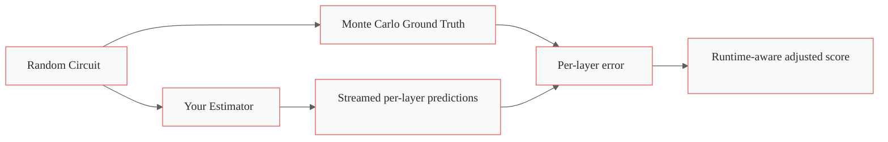
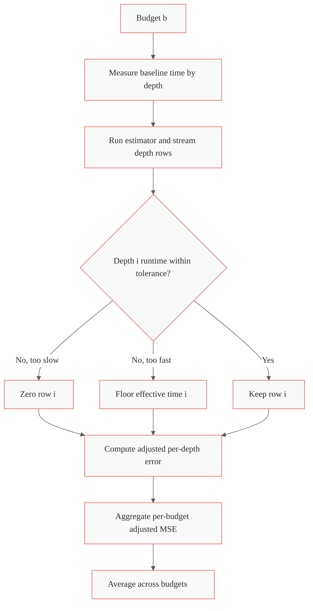
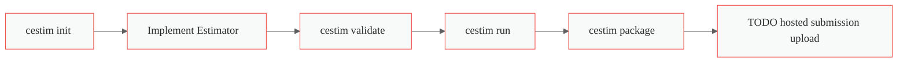

# Circuit Estimation Challenge Starter Kit

Build, test, and iterate estimators for the Circuit Estimation Challenge with a local evaluator, participant-first CLI, and an interactive Circuit Explorer.

## What Is The Problem?

At a high level, you are given a random layered circuit and a compute budget.
Your estimator must predict the expected value of every wire after every layer.

- Input to your estimator: one `Circuit`, one integer `budget`
- Output from your estimator: a stream of exactly `max_depth` vectors
- Shape per emitted vector: `(width,)`

The evaluator compares your streamed predictions against Monte Carlo ground truth and measures both quality and time behavior.



For a deeper explanation (intuitive + formal), see [What Is The Problem And How Is It Scored?](docs/guides/what-is-the-problem-and-how-is-it-scored.md).

## How Scoring Works

For each budget in `budgets`:

1. The evaluator measures a sampling baseline time by depth: `time_budget_by_depth_s`.
2. Your estimator streams one row per depth.
3. At each depth, runtime is checked against tolerance bounds.
   - Too slow: that depth row is zeroed.
   - Too fast: effective runtime is floored to the lower tolerance bound.
4. Per-budget adjusted error is aggregated across depths.

Final score is the mean adjusted error across budgets.
Lower is better.



## Install And Get The CLI Working (Short Version)

Install [`uv`](https://docs.astral.sh/uv/):

```bash
curl -LsSf https://astral.sh/uv/install.sh | sh
```

From repo root, install CLI:

```bash
uv tool install -e .
```

Sanity check:

```bash
cestim --agent-mode
```

If you use multiple worktrees, run from the current checkout explicitly:

```bash
uv run --with-editable . cestim --agent-mode
```

See [Install And CLI Quickstart](docs/guides/install-and-cli-quickstart.md) for a compact command cookbook.

## Participant Workflow

Use participant subcommands as the primary flow:



Quick commands:

```bash
# 1) Scaffold starter files in your working directory
cestim init ./my-estimator

# 2) Validate contract correctness
cestim validate --estimator ./my-estimator/estimator.py

# 3) Run local evaluation
cestim run --estimator ./my-estimator/estimator.py --runner subprocess --detail full --profile

# 4) Package an artifact
cestim package --estimator ./my-estimator/estimator.py --output ./submission.tar.gz
```

Hosted submission/upload flow is not wired yet.

`TODO: add official AIcrowd submission upload command and endpoint instructions.`

## Circuit Explorer: Build Intuition Fast

The interactive explorer helps you visually understand circuit dynamics and estimator behavior.

```bash
cd tools/circuit-explorer
npm install
npm run dev
```

Open `http://localhost:5173`.

Start guide: [How To Use Circuit Explorer](docs/guides/how-to-use-circuit-explorer.md)

## How To Write Your Own Estimator

Your estimator class should subclass `BaseEstimator` and implement:

- `setup(context)` (optional)
- `predict(circuit, budget)` (required, streaming)
- `teardown()` (optional)

Contract requirements:

- Emit exactly `circuit.d` rows
- Each row must have shape `(circuit.n,)`
- Values must be finite
- `yield` rows; do not return one final `(depth, width)` tensor

Start here:

- [How To Write Your Own Estimator](docs/guides/how-to-write-your-own-estimator.md)

## Validate, Run, Package, And Local Modes

- Validate entrypoint and stream contract:

```bash
cestim validate --estimator examples/estimators/random_estimator.py
```

- Local run (participant workflow):

```bash
cestim run --estimator examples/estimators/random_estimator.py --runner subprocess
```

- Debug mode (tracebacks + rich metrics):

```bash
cestim run \
  --estimator examples/estimators/random_estimator.py \
  --runner inprocess \
  --detail full \
  --profile \
  --debug \
  --agent-mode
```

- Test harness modes:

```bash
./scripts/run-test-harness.sh quick
./scripts/run-test-harness.sh full
./scripts/run-test-harness.sh exhaustive
```

Detailed run/validate/package guide: [How To Validate Run And Package](docs/guides/how-to-validate-run-and-package.md)

## What The Scores Mean

The report includes key metrics:

- `final_score`: leaderboard metric (lower is better)
- `adjusted_mse` per budget: quality with runtime adjustment
- `mse_mean`: raw prediction quality before runtime weighting
- `call_time_ratio_mean`: relative time vs baseline envelope
- `time_budget_by_depth_s`: per-depth runtime reference curve

Interpretation:

- Better estimators reduce error without violating per-depth time budgets.
- Better budget-aware estimators spend compute where score impact is highest.

Deep dive: [What Is The Problem And How Is It Scored?](docs/guides/what-is-the-problem-and-how-is-it-scored.md)

## Included Example Estimators

Use these as stepping stones:

- `examples/estimators/random_estimator.py`: interface walkthrough, intentionally low accuracy
- `examples/estimators/mean_propagation.py`: first-order moment baseline
- `examples/estimators/covariance_propagation.py`: second-order approximation baseline
- `examples/estimators/combined_estimator.py`: budget-aware switching baseline

Quick run examples:

```bash
cestim run --estimator examples/estimators/random_estimator.py --runner subprocess
cestim run --estimator examples/estimators/mean_propagation.py --runner subprocess
cestim run --estimator examples/estimators/covariance_propagation.py --runner subprocess
cestim run --estimator examples/estimators/combined_estimator.py --runner subprocess
```

More detail: [Example Estimators And How To Run Them](docs/guides/example-estimators-and-how-to-run-them.md)

## Documentation Map

- [Install And CLI Quickstart](docs/guides/install-and-cli-quickstart.md)
- [What Is The Problem And How Is It Scored?](docs/guides/what-is-the-problem-and-how-is-it-scored.md)
- [How To Use Circuit Explorer](docs/guides/how-to-use-circuit-explorer.md)
- [How To Write Your Own Estimator](docs/guides/how-to-write-your-own-estimator.md)
- [How To Validate Run And Package](docs/guides/how-to-validate-run-and-package.md)
- [Example Estimators And How To Run Them](docs/guides/example-estimators-and-how-to-run-them.md)
- [Worktrees and CLI](docs/development/worktrees-and-cli.md)

## Verification Commands

Run before finalizing changes:

```bash
uv run --group dev ruff check .
uv run --group dev ruff format --check .
uv run --group dev pyright
uv run --group dev pytest -m "not exhaustive"
uv run --group dev pytest -m exhaustive
```

## Authors

- Paul Christiano
- Jacob Hilton
- Sharada Mohanty
